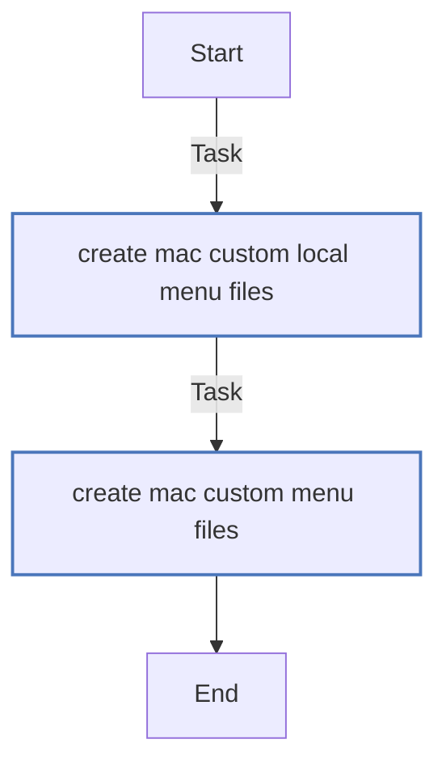
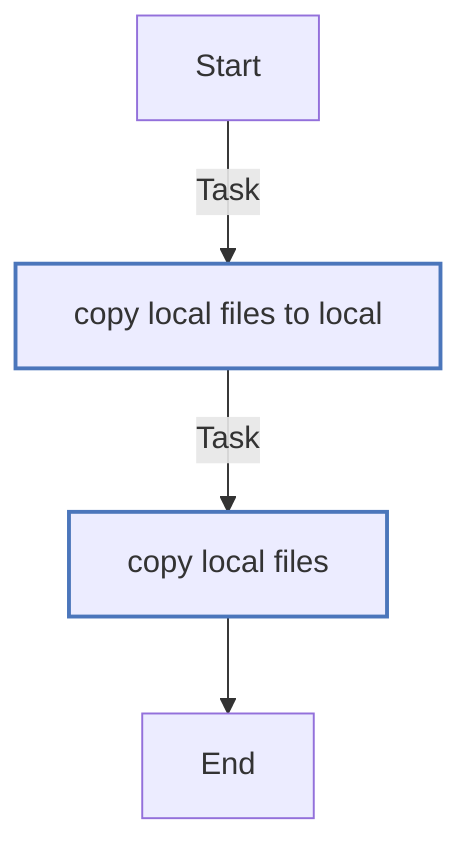
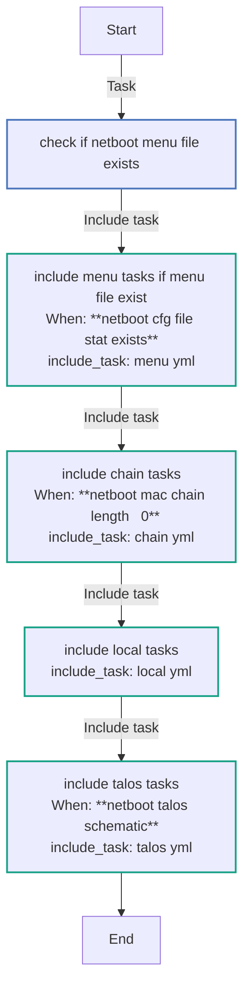
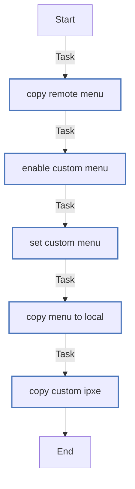
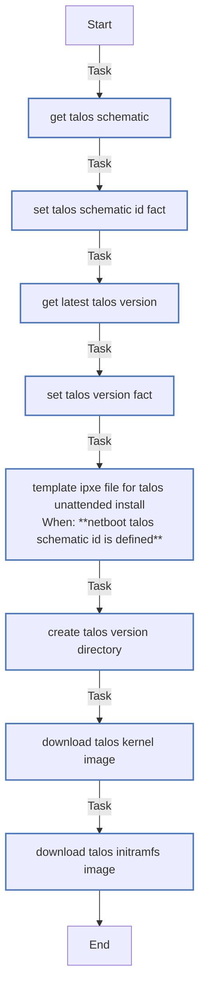

<!-- DOCSIBLE START -->

# 📃 Role overview

## netboot

Description: Maintains a set of files for a dockerized Netboot.xyz envirionment

### Defaults

**These are static variables with lower priority**

#### File: defaults/main.yml

| Var          | Type         | Value       |
|--------------|--------------|-------------|
| [netboot_container_user](defaults/main.yml#L1)   | str | `root` |    
| [netboot_container_group](defaults/main.yml#L2)   | str | `root` |    
| [netboot_base_dir](defaults/main.yml#L3)   | str |  |    
| [netboot_mac_chain](defaults/main.yml#L5)   | list | `[]` |    
| [netboot_talos_schematic](defaults/main.yml#L7)   | str |  |    

### Tasks

#### File: tasks/chain.yml

| Name | Module | Has Conditions |
| ---- | ------ | -------------- |
| Create MAC custom local menu files | ansible.builtin.copy | False |
| Create MAC custom menu files | ansible.builtin.copy | False |

#### File: tasks/local.yml

| Name | Module | Has Conditions |
| ---- | ------ | -------------- |
| Copy local files to local | ansible.builtin.copy | False |
| Copy local files | ansible.builtin.copy | False |

#### File: tasks/main.yml

| Name | Module | Has Conditions |
| ---- | ------ | -------------- |
| Check if netboot menu file exists | ansible.builtin.stat | False |
| Include menu tasks if menu file exist | ansible.builtin.include_tasks | True |
| Include chain tasks | ansible.builtin.include_tasks | True |
| Include local tasks | ansible.builtin.include_tasks | False |
| Include Talos tasks | ansible.builtin.include_tasks | True |

#### File: tasks/menu.yml

| Name | Module | Has Conditions |
| ---- | ------ | -------------- |
| Copy remote menu | ansible.builtin.copy | False |
| Enable custom menu | ansible.builtin.lineinfile | False |
| Set custom menu | ansible.builtin.lineinfile | False |
| Copy menu to local | ansible.builtin.copy | False |
| Copy custom ipxe | ansible.builtin.copy | False |

#### File: tasks/talos.yml

| Name | Module | Has Conditions |
| ---- | ------ | -------------- |
| Get Talos schematic | ansible.builtin.uri | False |
| Set Talos schematic ID fact | ansible.builtin.set_fact | False |
| Get Latest Talos version | ansible.builtin.uri | False |
| Set Talos version fact | ansible.builtin.set_fact | False |
| Template ipxe file for Talos unattended install | ansible.builtin.template | True |
| Create Talos version directory | ansible.builtin.file | False |
| Download Talos kernel image | ansible.builtin.get_url | False |
| Download Talos initramfs image | ansible.builtin.get_url | False |

## Task Flow Graphs

### Graph for chain.yml

### Graph for local.yml

### Graph for main.yml

### Graph for menu.yml

### Graph for talos.yml

## Author Information
Roxedus

#### License

Apache-2.0

#### Minimum Ansible Version

2.9

#### Platforms

No platforms specified.

#### Dependencies

No dependencies specified.
<!-- DOCSIBLE END -->